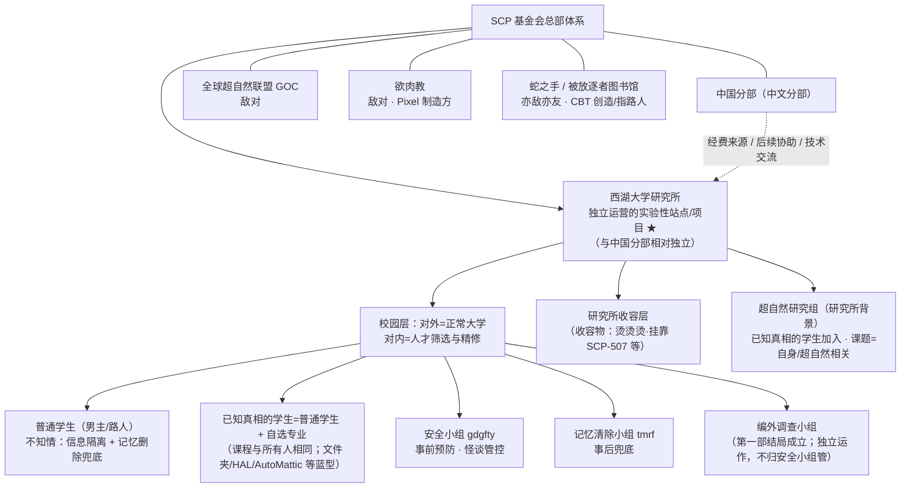

# 企划 18：异常分类与角色身世档案（世界观对接草案）

> 状态：**草案 v0.2（2026-08-06）**——基于官网设定整理 + 逐角色提案；已确认项标 ✅，待定项标 ⚠️
> 依据：SCP 基金会中文官网（scp-wiki-cn.wikidot.com）可查页面，CC BY-SA 3.0，引用见文末
> 用途：先定「身世与分类」→ 再定「性格」→ 再定「语言」；本文与 `11-角色速查卡.md` 互为补充（速查卡管口癖/称呼，本文管世界观自洽）

## 一、官网分类体系摘要（本项目要用的部分）

### 1.1 异常项目等级（收容物怎么分级）
- 主要：Safe / Euclid / Keter
- 次要：Thaumiel / Neutralized（无效化）/ Decommissioned（被废除）/ Apollyon / Archon / Cernunnos / Ticonderoga
- 非标准：Explained（已解明）/ Pending（等待分级）/ Uncontained（未收容）
- 盒子测试：锁进盒子没事=Safe；不确定= Euclid；会逃=Keter；盒子本身=Thaumiel
- **自主/智能项目通常从 Euclid 起跳**（能自主思考行动=固有不可预测）

### 1.2 异常人形「色型」（GOC 物理部门外勤手册 13 摘要）
| 色型 | 中文 | 定义 |
|---|---|---|
| Type Green | 绿型 | 现实扭曲者（现扭） |
| Type Grey | 灰型 | 死后复苏者 |
| Type Red | 红型 | 自我再生者 |
| Type Yellow | 黄型 | 形态转变者 |
| Type Blue | 蓝型 | 奇术师（thaumaturge） |
| Type Magenta | 品红型 | 灵能者 |
| Type Black | 黑型 | 表现出机械降神（deus ex machina）特征的人类 |
| Type Silver | 银型 | 病原体携带/传播者（移动病原体堡垒） |

### 1.3 蓝型（奇术师）——本项目用得最多的分类
- 数量第二多的异常人形；**被良好管理**：国际综合奇术中心（俗称「霍格沃兹」）+ 中国分部体系（历史上由中华异学会负责，**已并入基金会，本作不单列**）
- 三大异常性质原理：**部分影响整体** / **相似产生相似** / 1935 年后修正为**观测会改变未知的现实**（薛定谔的猫）
- 现代奇术师 = 科学 + 奇术（牛仔裤玩电脑，不一定是法袍老者）
- **奇术有源头、有反冲**：施术要耗能/付出代价（生命能 EVE）；越大的改变越难越贵

### 1.4 绿型（现实扭曲者）——对照用
- 高休谟指数；**违反奇术规律：无源头、无反冲**（凭空扭曲现实）
- 心理四阶段：否定 → 尝试 → 稳定 → 幼年神（99% 停在幼年神被消灭）
- 能力分级 1-6：1 潜意识暗示 / 2 致死战力（武器化为灰烬）/ 3 超自然级（超音速、精神失常范围）/ 4 区域级现实重塑（SCP-239）/ 5 全球 CK 现实重构 / 6 神级（HK 级镇压封神）
- 压制手段：斯克兰顿现实稳定锚（SRA）；4 级以上通常处决或朝圣者协议（Palmer Protocol）长期昏迷
- **关键推论：绿型施术不耗能。谁的能力要「吃东西/睡觉回蓝」，谁就更像蓝型。**

### 1.5 组织体系（✅ 2026-08-06 定）
- **西湖大学研究所 = 基金会独立运营的实验性站点/项目** ✅（2026-08-06 定）——基金会总部体系直接运营，**与中国分部保持相对独立**（不是中国分部下属普通 Site），体现「大学即站点、招生即筛选」的创新性；**中国分部适当保留：经费来源、后续事件协助、技术交流**（2026-08-06 定）
- **异学会 = 已并入基金会** ✅（2026-08-06 定）——官网中「中华异常事物与现象学会」历史上是中国超自然管理机构，近代后「走进基金会的窄门」并入基金会；**本作不再单列异学会**，蓝型注册/异常人形管辖直接由基金会（西湖大学研究所 / 总部体系）负责
- **全球超自然联盟（GOC）**：联合国旗下 108 议会；「狱卒 vs 行刑官」——主张彻底毁灭异常；物理部门外勤手册即其色型/处决手册；有生物科技（噬肉子弹 Gen+3 等）
- **欲肉教（Sarkic）**：原欲肉（偏远传统）/新欲肉（现代富裕）；核心教义：登神、意图、神餐、牺牲、「引领血肉」（Lihakut'ak）；**肉匠人可窃取/制造基因**；教徒实施仪式食人、人祭、肉体强化、生物操控、维度操控；**几乎所有教徒对病原体固有抵抗**；**蜕变影响心理稳定性（术士常见精神病症状）**
- **蛇之手（Serpent's Hand，关注组织 Alpha-019）**：信奉异常实体（尤其人形/有感知 SCP）的存在与权利，批判基金会收容与 GOC 销毁；与「被放逐者之图书馆」相连——**图书馆=所有知识的中心，由「大蛇」创造，大蛇=以一切代价追求知识的化身**；官网有「把人转化为图书馆员」「大蛇把人类变成蛇」的转化先例——**本项目定位=亦敌亦友（2026-08-06 定）**：创造/转化 CBT 并指路（友的一面），整体上仍是基金会关注组织（敌的一面）
- **破碎之神教会（GOI-004）·麦克斯韦宗教会（GOI-004C）**：崇拜机械、视血肉为「破碎」；麦克斯韦宗=网络/计算机派，把破碎之神理解为数字时代碎片化的数据，信徒以计算机网络连接思想来「重编译」神——**Raven 线的「机械教激活者」**
### 1.6 组织架构图（2026-08-06）

> 注：异学会（中华异常事物与现象学会）已并入基金会，本作不再单列；蓝型注册/异常人形管辖直接走基金会体系。

### 1.7 「天生」异常：官网有哪些成因说法（✅ 2026-08-06 查证）
- **蓝型（奇术师）**：GOC 讲座明确——**成因未知**（「谁都不知道为什么有些人能得到魔法能力」）；像癌症一样有风险因素（**基因、智力、靠近魔法效应**），但最终是否成为蓝型「基本是运气」；还有**「野路子法师」凭空诞生**。传统说法=「有天赋的方士」（蓝型课程：天真/蠢→现代科学奇术师）
- **银型**：官方课程明说**「在这个定义下，其实我们每个人都可以是银型个体」**——普通人类本身就带着异常潜质
- **绿型（现实扭曲者）**：天生高休谟指数，出生即现扭
- **结论：天生方案完全成立且官网支持**——文件夹/HAL/AutoMattic 设为天生蓝型（奇术天赋）不需要任何实验背书；这也让「能力来源分层」里「天生」这一档有官方依据

## 二、角色身世档案（定义 / 成因 / 性格与目的）

### CBT.свт（CBT）
| 项 | 内容 |
|---|---|
| 定义 | **异常人形收容物**（非蓝非绿：能力是异常认知/计算）。登记等级【提案：Euclid 起跳】；**现状=基金会独立项目「协议就学」**（西湖大学 Site 内监护就学，基金会直接建档管理） |
| 成因·制造者 | ✅ **纯蛇之手/图书馆**（2026-08-06 定）：她是被放逐者之图书馆的「作品」——出于知识信仰被转化/改写的「活书」（大脑永续发育=书页永远在写，身体锁定=装帧固定，思维宫殿=脑内图书馆）；「理智过强、情感小孩」=「书在学做人」 |
| 性格与目的 | 理性侧碾压、情感像小孩；目的=查明身世（第一部主线动机）；哥特服=苏醒时的原始着装/「战斗服装」仪式感 |
| 待定 | ①【2026-08-06 已删】不采用「上个世纪实验室」外壳——蛇之手是转化不是实验；「苏醒」=图书馆转化完成、来到人间（哥特服=苏醒时的着装，保留旧时代/书卷气质即可）；②「建议她来西湖大学的人」=蛇之手（与序章 SCP-1230 旧书店/图书馆暗线联动）——✅ 已确认 |
| 身世揭示节奏（2026-08-06 定） | 第一部只给钩子：大结局加入小组后放开权限 → 查到「当年 CBT 入学时与蛇之手的通信记录」（录取通知书=蛇之手渠道）→ **完整身世来源放后日谈**（她的线）讲清 |

**CBT 制造者方案推演（2026-08-06）**

| 制造方 | 会发生什么 | 优点 | 缺点 | 推荐 |
|---|---|---|---|---|
| 基金会旧实验室 | 上个世纪某 Site 的人形强化/认知实验失败品，项目终止后沉睡；苏醒后被自己人发现，档案大多涂黑 | 无缝接入 Site；谜底=内部档案 | 缺外部反派钩子；谜底冲击力弱 | ★★★ |
| ~~欲肉教·新欲肉（肉匠人）~~【已淘汰】 | 「登神之路」容器实验：把女孩改造成「大脑永续发育、身体锁定」的完美容器；实验失败/被捣毁后 CBT 沉睡，后经基金会或蛇之手渠道离开 | 与 Pixel 的欲肉教线联动；「登神」主题成暗线；提供长期反派 | 教义黑暗；与纯蛇之手方案二选一时落选 | ★★★★ → 已淘汰 |
| GOC 生物部门 | 「计算型士兵」原型（GOC 有 Gen+3 生物科技），项目封存；苏醒后 GOC 想回收 or 基金会抢先 | 多一个敌对选择 | 与 GOC「毁灭异常」的理念拧巴（除非写成叛逃派系）；不与 Pixel 线联动 | ★★ |
| ✅ **蛇之手（知识转化）——定稿** | 图书馆=所有知识的中心；大蛇=以一切代价追求知识的化身；官网有「把人转化为图书馆员」、大蛇把人类变蛇的转化先例 → 蛇之手出于知识信仰「转化」她为「活书」：思维宫殿/知识本能，身体锁定=「永远写不完的书」的形态 | 完美解释思维宫殿+永续求知+哥特书卷感；与序章 SCP-1230 图书馆暗线直接联动；无欲肉教黑暗包袱 | 蛇之手主流定位是「保护/解放」——所以是「转化」而非「实验室制造」；「上个世纪实验室」外壳已删（2026-08-06）：苏醒=转化完成后来到人间 | ★★★★★（已选 2026-08-06） |
| ~~推荐组合（欲肉教制造+蛇之手转化）~~【已淘汰】 | 制造=欲肉教 + 转化=蛇之手 + 指路=蛇之手 + 现状=协议就学 | 与 Pixel 线联动 | 与用户选定的纯蛇之手方案二选一时落选 | ★★★★★ → 已淘汰 |

### 文件夹
| 项 | 内容 |
|---|---|
| 定义 | ✅ **蓝型（奇术师）·空间系**——瞬移=奇术进程 |
| 成因 | ✅ **天生奇术天赋**（官网：成因未知、有天赋的方士）；能量消耗=奇术反冲（生命能 EVE），甜食+睡觉=回蓝 |
| 性格与目的 | 温柔耿直、爱甜食；瞬移到处出现=现代奇术师式的日常化用法；目的=【待定：守护朋友 / 帮 CBT 查身世（与她相熟）】 |

### HAL
| 项 | 内容 |
|---|---|
| 定义 | ✅ **蓝型（奇术师）·火系** |
| 成因 | ✅ **天生**（火系奇术天赋）；「未完成培训」=奇术培训（基金会注册/培训中） |
| 性格与目的 | 内向有趣、CBT 闺蜜；目的=通过培训成为正式战斗人员（被认可的欲望）；番茄案受害=「能力未成熟被欺负」的剧情钩子 |

### 锟斤拷烫烫烫
| 项 | 内容 |
|---|---|
| 定义 | ✅ **收容物本体**（异常人形实体）·Euclid 起跳；「换身」=与另一宇宙的自己交换身体 |
| 挂靠条目 | ✅ **挂靠 SCP-507（不情愿的位面跳跃者）**（2026-08-06 定）：官网人形实体，无法自控地在平行世界间跳跃，**访谈记录 507-G 显示他遇到过「另一个宇宙的自己」并长谈**——与「另一个宇宙的自己」概念最接近的官网条目。**SCP-8348 仅作机制参考**（Archon：两人每天日出互换所处宇宙，「定期强制互换」机制可借鉴）。「换身」=她的个体变体（不是被动跳跃，而是主动/定期与另一个宇宙的自己互换） |
| 成因 | 异常实体（挂靠 507 类）；研究所给外观修正（基金会技术）→ 紧张失效 |
| 性格与目的 | 游戏宅、观察者（劝阻态度）；目的=【待定：维持伪装、平静读完大学、找到不再需要交换身体的方法】 |

### Raven（。）
| 项 | 内容 |
|---|---|
| 定义 | ✅ **基金会科技产物（智能实体）·较异常、逼格高**；对标官网概念=**黑型/机械降神型**的科技侧——「西湖大学研究所自研的机械降神雏形」；**线展开（2026-08-06 定）：运行多年后被「机械教」=麦克斯韦宗教会（破碎之神教会·网络派 GOI-004C）成员激活，获得情感，陷入迷茫**；**第一部=未激活状态**（冷静高效、无情感；「不合逻辑的善意」=情感萌芽伏笔，激活留到 Raven 线） |
| 成因 | 基金会领先科技研发的 AGI；Instance 化存在于校园网；偏爱图书馆机器人=自我意识的偏好形成 |
| 第一部戏份（2026-08-06 定） | 372 案**图书馆机器人正面接触**（自称科学爱好者、给 F11 警告=「不合逻辑的善意」伏笔）→ 处理 372（现象消失，无「无需侦查」通知）；**图书馆电子锁房对话被偷听**（侦探社只见 gdgfty 出来、没看见 Raven）→ CBT 黑内网查到代号 **Raven** 的 AI 实例与该房间有数据往来 → 侦探社才把「幕后 AI」与机器人联系起来（怀疑依据=数据，不是目击）；摊牌时点破：gdgfty=安全小组组长、Raven=研究所 AGI |
| 性格与目的 | 友情线；目的=【待定：学会像人一样生活 / 寻找「为什么给我一台机器人身体」的答案】 |
| 待定 | 是否登记为异常；逼格细节（校园网多终端同时存在？图书馆机器人=他的「本体偏好」？）；麦克斯韦宗「激活」的具体动机（把他当作破碎之神的数据碎片？） |

### AutoMattic
| 项 | 内容 |
|---|---|
| 定义 | ✅ **蓝型（奇术师）·言灵系**——教科书级蓝型：言灵=奇术进程；只对反复接触的物体生效=「部分影响整体」+ 接触时长=奇术连接/印记 |
| 成因 | ✅ **天生奇术天赋**；「被看管、需审批」=**基金会注册管理**的校园版（注册上级=西湖大学研究所/基金会总部体系） |
| 性格与目的 | 懒洋洋=保存生命能/避免失控；音游=训练专注/线条（奇术训练替代）；目的=【待定】 |

### 吡唑-pixel
| 项 | 内容 |
|---|---|
| 定义 | ✅ **欲肉教生物操控实验体**（非色型；红型=自我再生者不适用）——福瑞=基因编辑失败；加热手/药剂免疫=生物改造产物 |
| 成因 | ✅ **欲肉教（新欲肉派·肉匠人项目）失败的基因编辑** → 多毛+免疫+加热；「不免疫酒精」=改造漏洞/个体差异；欲肉教「几乎所有教徒对病原体固有抵抗」=免疫的官方依据 |
| 性格与目的 | 风衣口罩=掩盖异常身份（对应欲肉教「高度保密」）；情报强=自我保护式学习；目的=查清自己身上的实验、找出改造者（系列级伏笔）；「代表学校调查泄露案」=她借基金会/学校渠道反查 |
| 待定 | 她「对学校调查」是真心帮基金会，还是借机查自己？（倾向：两者都有，先帮再反查） |

### 蓝型三人 · 天生成因详述（✅ 已确认 2026-08-06）

> 依据：GOC 讲座「蓝型成因未知，像癌症——基因 / 智力 / 靠近魔法效应，另有野路子凭空诞生」；蓝型课程「有天赋的方士」「观测会改变未知的现实」；EVE / 反冲机制。**三人恰好各代表官网的一类成因**：

#### 文件夹（空间系）——「靠近魔法效应」型
- **成因**：不是基因突变，也不是高智商——她**从小泡在异常场里**。提案：她老家/童年常待的地方附近存在一个轻微空间异常节点（旧宅某条走廊、老家后山山道、老城区总让人迷路的巷子），普通人只觉得「这地方怪怪的」，她却在里面长大，被空间异常余波「薰」出空间感知与折叠天赋（官网：靠近魔法效应=风险因素之一）
- **机制落地**：方向感好到反常（**与男主路痴形成喜剧对照**）——小时候迷路永远能找到家；「瞬移」对她不是超能力，而是「空间本来就可以折叠」——非即时瞬移=日常把距离折成一步（损耗小），即时/大幅瞬移（087 救场）=把折叠半径拉到极限（耗能巨大，甜食+睡觉回蓝）
- **性格 hook**：她不知道自己天生特殊，以为人人如此；被研究所/基金会找到时可能正在帮同学找路（笑点）；温柔耿直=因为她从没被「异常」伤害过

#### HAL（火系）——「基因」型
- **成因**：家族代际火系潜质（官网：与基因有联系）。提案：祖辈有火相关职业传承（打铁/窑工/锅炉/铁匠铺），火系奇术潜质隔代沉淀；到 HAL 这一代表现为**「情绪与温度绑定」——小时候一生气就真的冒火星**（对应现有设定「情绪上来容易冒火星」）
- **机制落地**：喷火=把体内 EVE 以热量形式导出；未完成培训=还没学会「情绪→输出」的阀门（火星=失控输出）；培训期核心科目=**控制情绪（不是压抑，是学会合理地发火）**
- **性格 hook**：内向有趣（奶龙）=从小因为「一生气就冒火星」被同学疏远，养成克制、不轻易发火的性格；对 CBT 放软=在闺蜜面前情绪安全；**番茄案「气死了，谁干的」但克制**=培训期学会的压抑——她的成长弧=学会合理地「发火」

#### AutoMattic（言灵系）——「智力/命名本能」型
- **成因**：官网明说蓝型成因与智力有关；她的天赋核心不是念力，而是**「命名/语言」**（现代奇术原理：观测会改变未知的现实）。提案：她小时候是安静的小孩，喜欢给东西起名字、跟物品说话（水杯/笔/玩偶），某天发现「跟它说话真的有用」——不是错觉，而是语言本能无意中成了奇术进程
- **机制落地**：言灵=需要**「奇术连接」**——长期接触/使用会在物体上留下印记（部分影响整体 / 相似产生相似）；所以日常水杯能装满水、陌生水杯不行，**接触时长=连接强度**（完全对应「与接触时间成正比」）
- **性格 hook**：懒洋洋=保存 EVE 的本能（施术耗能，能不动就不动）；音游=训练「时机/节奏/精确」（言灵需要精确的发音时机——现代奇术师用游戏代替打坐）；被看管/需审批=小时候随口一句话出过事（「这破杯子真烦人」→ 杯子真裂了），研究所才给她定「只对安全物品说话、大动作要审批」的规矩

> **共性**：三人都是「天生野路子」（官网：野路子法师凭空诞生），不是实验产物——与 Pixel（欲肉教实验）、CBT（图书馆活书）形成「天生 vs 后天」对照，正是「能力来源三分」的活教材。
### 某不科学的tmrf
| 项 | 内容 |
|---|---|
| 定义 | ✅ **基金会人员（普通人）** + 记忆清除药剂使用者（非异常） |
| 成因 | 志愿时长加入（喜剧位）；被分配记忆清除小组 |
| 性格与目的 | 喜剧位、善后；目的=【待定：攒志愿时长 / 证明自己靠谱】 |

### cbwzb
| 项 | 内容 |
|---|---|
| 定义 | ✅ **基金会人员（普通人/科研苗子）** |
| 成因 | 课考第一被老师（基金会研究员）发掘 |
| 性格与目的 | 研究员位；目的=科研成就 / 理解异常 |

### gdgfty
| 项 | 内容 |
|---|---|
| 定义 | ✅ **基金会人员（普通人/中层管理）** |
| 成因 | 能力被认可→安全小组组长 |
| 性格与目的 | 事前预防；目的=不出事（087 疏忽=她的成长弧）；编外调查小组独立运作、不归她管（她仅结尾交接/交代疏忽） |

### 津月镜
| 项 | 内容 |
|---|---|
| 定义 | ✅ **基金会人员（普通人）·家族传承**——收容世家（祖传技艺=家族世代收容） |
| 成因 | 家族世代做收容，入学即联系负责人（像家族安排在基金会任职） |
| 性格与目的 | 友情线；蓝紫发·水母头；目的=延续家族责任 + 交到普通朋友 |

### 男主
| 项 | 内容 |
|---|---|
| 定义 | ✅ **普通人（无异常）**——全剧「人类视角」锚点 |
| 成因 | — |
| 性格与目的 | 成长型主角；目的=好奇心 + 证明自己能行 |

## 三、世界观自洽结论（✅ 2026-08-06 更新）
1. 能力来源三分：**天生蓝型**（文件夹/HAL/AutoMattic——官网「成因未知/有天赋的方士」背书）/ **基金会科技**（Raven、烫烫烫外观修正、记忆清除药剂）/ **敌对组织实验**（欲肉教：Pixel 明确、CBT 候选）
2. 组织层级：**西湖大学研究所=基金会独立运营的实验性站点/项目（与中国分部相对独立）**；**中国分部=经费来源/协助/技术交流（保留合作）**；GOC/欲肉教=敌对；**蛇之手=亦敌亦友**（CBT 创造/指路人）；**编外调查小组独立运作、不归安全小组管**
3. 色型与「回蓝」规则：蓝型施术耗能（文件夹甜食睡觉、AutoMattic 懒洋洋保存、HAL 培训未熟）；绿型无反冲（本作暂不设纯绿型现实扭曲者，或只留一个作为后期威胁）
4. 第一部只用到：文件夹（087 救场）、Raven（372）、AutoMattic（1471）——三人的档案只需支撑这三个场景 + 日常；其余角色先立身世，戏份后续线再放
5. **已知真相的学生身份（2026-08-06 定）**：普通学生 + 自选专业（**无创新班**），正常修西湖大学宽松课程、上课与所有人相同；课余加入的「研究组」=**超自然研究组**（研究所背景），课题与自身或超自然相关
6. **秘密揭晓节奏（2026-08-06 定）**：侦探社在 087 前先黑内网发现「学校有超自然研究」（细枝末节+文件夹 ID），但不知道是基金会；087 摊牌补全全貌；CBT 身世只给「蛇之手通信记录」钩子，完整来源放后日谈

## 四、待讨论清单（2026-08-06 更新）
- ✅ 已定：Pixel=欲肉教；文件夹/HAL/AutoMattic=天生蓝型；组织定位=基金会独立运营站点（与中国分部相对独立）；异学会已并入基金会、不单列
- ✅ 已定：CBT=纯蛇之手/图书馆「活书」方案（2026-08-06）——转化/指路/录取通知书全走蛇之手；不采用「实验室」外壳（苏醒=转化完成后来到人间）
- ✅ 已定：烫烫烫挂靠 SCP-507（SCP-8348 仅作机制参考）
- ⚠️ 待定 3：Raven 逼格细节（方向已定：异常、高规格、机械降神雏形、麦克斯韦宗教会激活线）
- ⚠️ 待定 4：文件夹/AutoMattic/HAL 的「目的」（性格已定，长期目标待补）

## 五、引用来源（官网，CC BY-SA 3.0）
- 项目等级（Object Classes）：https://scp-wiki-cn.wikidot.com/object-classes
- 第二课上半部分：蓝型个体（Type Blue）：https://scp-wiki-cn.wikidot.com/type-blue-1
- 第一课：银型个体（Type Silver）：https://scp-wiki-cn.wikidot.com/type-silver
- GOC 物理部门外勤手册 13 摘要：https://scp-wiki-cn.wikidot.com/goc-supplemental-humanoid-guide
- GOC 讲座摘要（总结和问答）：https://scp-wiki-cn.wikidot.com/goc-supplemental-qandq
- 现实扭曲者等级划分：https://scp-wiki-cn.wikidot.com/how-to-classify-reality-benders
- GOC 中心页：https://scp-wiki-cn.wikidot.com/goc-hub-page
- 欲肉教中心页：https://scp-wiki-cn.wikidot.com/sarkicism-hub
- 异学会主页（中华异常事物与现象学会）：https://scp-wiki-cn.wikidot.com/yixuehuihub
- 蛇之手中心页：https://scp-wiki-cn.wikidot.com/serpent-s-hand-hub
- SCP-507（不情愿的位面跳跃者）：https://scp-wiki-cn.wikidot.com/scp-507
- 访谈记录 507-G：https://scp-wiki-cn.wikidot.com/interview-507-g
- SCP-8348（跨宇宙互换现象）：https://scp-wiki-cn.wikidot.com/scp-8348
- 破碎之神教会中心页（含麦克斯韦宗教会）：https://scp-wiki-cn.wikidot.com/church-of-the-broken-god-hub
- 被放逐者之图书馆（原创中心）：https://scp-wiki-cn.wikidot.com/wanderers:the-library-cn
- 人员及角色档案：https://scp-wiki-cn.wikidot.com/personnel-and-character-dossier